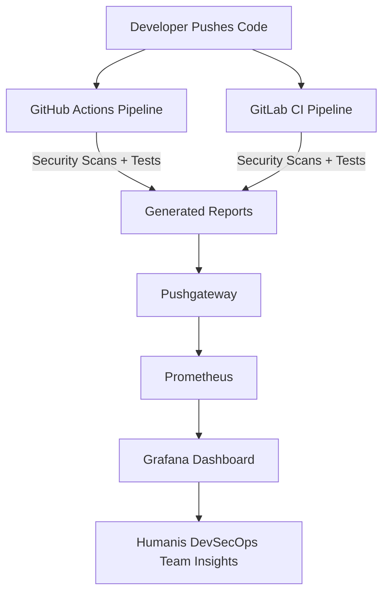

# **Humanis – Secure DevSecOps Pipeline with Monitoring & CI/CD**

**Fall 2025 Project Submission**

The Humanis DevSecOps Pipeline Project showcases a complete, end-to-end secure CI/CD system using:

* **GitHub Actions**
* **GitLab CI/CD**
* **Secrets detection tools** (Gitleaks + TruffleHog)
* **Security scanning** (Bandit)
* **Automated testing** (pytest)
* **Observability stack** (Pushgateway → Prometheus → Grafana)
* **Local pipeline simulation** using ACT
* **Deployment stubs** for future AWS integration

The objective is to demonstrate industry-grade DevSecOps practices: **automation, security, visibility, and reproducibility**.

---

# **1. Project Overview**

Every code push in Humanis triggers a complete DevSecOps lifecycle:

1. **Secrets scanning** (Gitleaks + TruffleHog)
2. **Static analysis** (Bandit)
3. **Automated tests** (pytest)
4. **Metrics export to Pushgateway**
5. **Prometheus scraping**
6. **Grafana visualization**

This allows the Humanis team to track:

* When secrets are introduced
* How security posture changes over time
* Pipeline reliability
* Differences between GitHub and GitLab workflows

The application itself is intentionally simple (Flask API) so the focus remains on DevSecOps engineering.

---

# **2. System Architecture**



This represents the full flow from development to monitoring.

---

# **3. Technology Stack**

### **CI/CD**

* GitHub Actions
* GitLab CI/CD
* ACT (local runner)

### **Security Scanning**

* **Gitleaks** — detects leaked credentials
* **TruffleHog** — high-entropy and suspicious secrets
* **Bandit** — Python static vulnerability scanner

### **Application Stack**

* Python 3.x
* Flask API
* pytest (unit testing)

### **Monitoring**

* Pushgateway
* Prometheus
* Grafana

### **Containers**

* Docker
* Docker Compose

---

# **4. Running the Monitoring Stack**

Inside the `monitoring/` folder:

```bash
docker compose up -d
```

Services launched:

| Service     | URL                                                            |
| ----------- | -------------------------------------------------------------- |
| Grafana     | [http://localhost:3000](http://localhost:3000) (admin / admin) |
| Prometheus  | [http://localhost:9090](http://localhost:9090)                 |
| Pushgateway | [http://localhost:9091](http://localhost:9091)                 |

Prometheus continuously scrapes Pushgateway, powering real-time dashboards.

---

# **5. Running the CI Pipeline Locally (using ACT)**

Run the full GitHub Actions pipeline locally:

```bash
act -W .github/workflows/ci.yml --reuse
```

This simulates:

* Gitleaks
* TruffleHog
* Bandit
* pytest
* Metrics push → Pushgateway
* Deployment stub

Metrics will appear at:

```
http://localhost:9091/metrics
```

Look for:

```
gitleaks_secrets_found
trufflehog_secrets_found
pipeline_status
```

These values flow into Prometheus and populate Grafana automatically.

---

# **6. Monitoring Workflow (Pushgateway → Prometheus → Grafana)**

### **1. CI → Pushgateway**

Pipeline pushes metrics:

```
gitleaks_secrets_found X
trufflehog_secrets_found Y
pipeline_status 1
```

### **2. Pushgateway → Prometheus**

Prometheus scrapes `/metrics` every 15 seconds.

### **3. Prometheus → Grafana**

Grafana visualizes key risk and reliability metrics.

This creates actionable visibility into:

* Secrets leakage
* Pipeline health
* Vulnerability trends
* CI/CD reliability

---

# **7. Visualizations (Grafana Dashboard Panels)**

The Humanis Grafana dashboard contains several panels:

---

## **7.1 Gitleaks Findings (Stat Panel)**

**PromQL Query:**

```
gitleaks_secrets_found
```

Displays the number of leaked secrets found per pipeline run.

* Green → 0
* Red → 1

---

## **7.2 TruffleHog Findings (Stat Panel)**

**PromQL Query:**

```
trufflehog_secrets_found
```

Detects suspicious entropy-based leaks.

---

## **7.3 Combined Security Exposure (Gauge)**

**PromQL Query:**

```
gitleaks_secrets_found + trufflehog_secrets_found
```

Visualizes total security risk in a single view.

---

## **7.4 Secrets Over Time (Line Chart)**

**PromQL Query:**

```
gitleaks_secrets_found
trufflehog_secrets_found
```

Shows spikes when fake or real leaks occur, enabling trend analysis.

---

## **7.5 Pipeline Status Indicator**

**PromQL Query:**

```
pipeline_status
```

Encodes pipeline health as:

* `1` = success
* `0` = failure

Useful for tracking reliability over long periods.

---

# **8. Generating Demo Leak Visualizations**

To demonstrate non-zero leak data:

1. Create a file:
   `fake_secret.txt`

2. Add safe dummy secrets:

```
AWS_SECRET_ACCESS_KEY="FAKE123456789"
PASSWORD="not_real"
API_KEY="0000000000000000000000"
```

3. Run ACT again.

Your Grafana dashboard will now show:

* Spikes in leak findings
* Changes in security exposure
* Updated risk gauge

Perfect for academic or demo presentations.

---

# **9. GitHub Actions Pipeline Summary**

Stages executed:

| Stage        | Purpose                        |
| ------------ | ------------------------------ |
| gitleaks     | Detect leaked secrets          |
| trufflehog   | Find entropy-based credentials |
| tests        | Bandit + pytest                |
| push_metrics | Push metrics for monitoring    |
| deploy       | Deployment stub                |

Runs identically in ACT for local development.

---

# **10. GitLab CI Pipeline Summary**

Mirrors GitHub Actions for platform comparison:

1. secrets_scan
2. security_scan
3. tests
4. push_metrics
5. deploy

This dual-pipeline approach demonstrates DevSecOps across both ecosystems.

---

# **11. SWOT Analysis (Humanis DevSecOps Pipelines)**

### **GitHub Actions**

**Strengths:** Huge marketplace, OIDC, simple UX
**Weaknesses:** Advanced features behind paid tiers
**Opportunities:** Workflow reuse, strong community
**Threats:** Vendor lock-in

### **GitLab CI**

**Strengths:** Fully integrated DevSecOps tools
**Weaknesses:** Runner setup complexity
**Opportunities:** Unified code+security ecosystem
**Threats:** Heavy system for small teams

---

# **12. Final Conclusion**

The Humanis DevSecOps Pipeline demonstrates how modern engineering teams integrate:

* **Security automation**
* **Continuous monitoring**
* **Cross-platform CI/CD**
* **Metrics-driven insights**
* **Reproducible local pipelines**

By combining GitHub Actions, GitLab CI, Prometheus, Pushgateway, and Grafana, Humanis transforms traditional CI/CD into a **security-aware, observable, and intelligent pipeline system**.

This project fulfills the academic requirements for **Fall 2025 DevOps** and serves as a practical demonstration of real-world DevSecOps practices.

---

# **13. Credits**

Created by **Group HUmanis**
Submitted for **DevOps – Fall 2025, Humanis**
