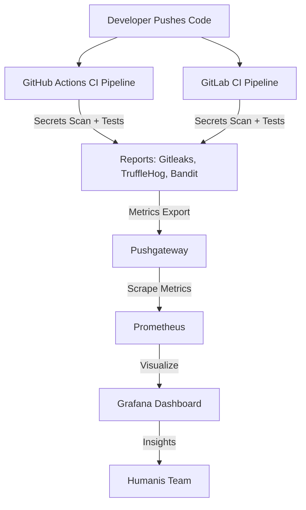

# **Humanis – Secure DevSecOps Pipeline with Monitoring & CI/CD (Fall 2025)**

This repository contains the **Humanis DevSecOps Pipeline Project**, submitted for the **Fall 2025 DevOps course**.
The goal is to design, implement, and compare secure CI/CD pipelines across **GitHub Actions** and **GitLab CI**, integrating:

* Automated **secrets detection** (Gitleaks + TruffleHog)
* Automated **security scanning** (Bandit)
* Automated **testing** (pytest)
* Containerized development (Docker)
* Observability stack (Prometheus + Pushgateway + Grafana)
* Local CI simulation using **ACT**
* Optional AWS ECS deployment stubs

This project embodies the core values of DevSecOps:
**automation**, **security**, **visibility**, and **repeatability**.

---

# **1. Project Overview**

The Humanis project demonstrates what a modern secure pipeline looks like:

1. **Code is pushed** → GitHub Actions / GitLab CI triggers
2. **Secrets scanning** runs immediately
3. **Security analysis (Bandit)** runs
4. **Tests (pytest)** validate the application
5. **Metrics** from scans are sent to **Pushgateway**
6. **Prometheus** scrapes them
7. **Grafana** visualizes the security posture over time

This allows a development team to quickly see:

* When secrets were introduced
* How many security issues were detected
* Trends in pipeline health
* Comparisons between GitHub and GitLab pipelines

The Humanis project intentionally uses a **simple Flask API** so that the focus remains on the **pipeline, monitoring, and DevSecOps practices** rather than application complexity.

---

# **2. Architecture**

Here is the high-level architecture of the Humanis DevSecOps system:



---

# **3. Technology Stack**

### **CI/CD**

* GitHub Actions
* GitLab CI/CD
* ACT (local GitHub runner)

### **Security Tools**

* **Gitleaks** – credential patterns
* **TruffleHog** – entropy & regex-based secret detection
* **Bandit** – Python static analysis

### **Monitoring Tools**

* **Pushgateway** – CI pushes metrics
* **Prometheus** – scrapes & stores
* **Grafana** – visual dashboards

### **Application**

* Python 3.x
* Flask REST API
* pytest

### **Containers**

* Docker
* Docker Compose

---

# 🛠 **4. Running the Monitoring Stack (Prometheus + Grafana + Pushgateway)**

Inside the `monitoring/` folder:

```bash
docker compose up -d
```

This launches:

| Service     | URL                                                            |
| ----------- | -------------------------------------------------------------- |
| Grafana     | [http://localhost:3000](http://localhost:3000) (admin / admin) |
| Prometheus  | [http://localhost:9090](http://localhost:9090)                 |
| Pushgateway | [http://localhost:9091](http://localhost:9091)                 |

Prometheus automatically scrapes metrics pushed by the CI pipeline.

---

# **5. Running the CI Pipeline Locally with ACT**

Because the Humanis project uses CI heavily, ACT allows you to run the GitHub workflow offline:

```bash
act -W .github/workflows/ci.yml --reuse
```

This executes:

1. Gitleaks
2. TruffleHog
3. Bandit
4. Pytest
5. Metrics push to Pushgateway
6. Deployment stub

Metrics appear in Pushgateway at:
[http://localhost:9091/metrics](http://localhost:9091/metrics)

Look for:

```
gitleaks_secrets_found
trufflehog_secrets_found
```

These values populate Grafana automatically.

---

# **6. Monitoring Workflow Explained**

### ✔ CI pushes metrics:

```
curl --data-binary "gitleaks_secrets_found 0" http://localhost:9091/metrics/job/ci
curl --data-binary "trufflehog_secrets_found 0" http://localhost:9091/metrics/job/ci
```

### ✔ Pushgateway temporarily stores them

### ✔ Prometheus scrapes them every 15 seconds

### ✔ Grafana dashboards visualize them

This creates:

* Security posture over time
* Trend lines for leaks
* Per-tool breakdowns
* Human-readable DevSecOps insights

---

# **7. Grafana Dashboard Panels**

The Humanis Grafana dashboard includes:

### **1. Secrets Findings – Gitleaks**

SingleStat panel

* Green = 0
* Red = >0

### **2. Secrets Findings – TruffleHog**

Same as above but for a different tool

### **3. Combined Security Exposure Gauge**

```
gitleaks_secrets_found + trufflehog_secrets_found
```

### **4. Secrets Over Time (Line Chart)**

Query example:

```
gitleaks_secrets_found
trufflehog_secrets_found
```

### **5. Pipeline Health Timeline**

Shows how often pipelines run and pass.

This dashboard is core to the Humanis project:
**it makes security measurable**.

---

# **8. GitHub Actions Pipeline Summary**

The GitHub workflow performs:

| Stage            | Description                    |
| ---------------- | ------------------------------ |
| **gitleaks**     | Detects leaked secrets         |
| **trufflehog**   | Entropy-based secret detection |
| **tests**        | Bandit + pytest                |
| **push_metrics** | Sends metrics to Pushgateway   |
| **deploy**       | Stub for real AWS deploy       |

Local execution via ACT ensures the pipeline works even offline.

---

# **9. GitLab CI Pipeline Summary**

The `.gitlab-ci.yml` mirrors GitHub Actions to allow full platform comparison.

Stages:

1. secrets_scan
2. security_scan
3. tests
4. push_metrics
5. deploy

This dual-pipeline approach is essential for comparing two DevSecOps ecosystems.

---

# **10. Humanis DevSecOps SWOT Analysis**

### **GitHub Actions**

**Strengths**

* Marketplace with a huge library of security and DevOps actions
* OIDC + AWS integrations
* Easier learning curve

**Weaknesses**

* Advanced security features require GitHub Advanced Security

**Opportunities**

* Extensible workflows, reusable modules

**Threats**

* Vendor lock-in

---

### **GitLab CI**

**Strengths**

* Complete integrated DevSecOps platform
* Built-in security scanning

**Weaknesses**

* More complex runner setup
* Enterprise features behind paywall

**Opportunities**

* Incredible synergy between repos, issues, scan results

**Threats**

* Heavier system for small teams

---

# **11. Final Conclusion**

The Humanis DevSecOps project demonstrates how a modern engineering team can integrate:

* **Security automation**
* **Observability**
* **Cross-platform CI/CD**
* **Metrics-driven insights**
* **Local reproducibility**

By combining GitHub Actions, GitLab CI, Prometheus, Pushgateway, and Grafana, this project shows how DevSecOps transforms pipelines into intelligent, security-aware systems.

This submission fulfills the goals of the Fall 2025 DevOps course, providing a working, monitored, secure CI/CD system for the Humanis application.


# **12. Credits**
